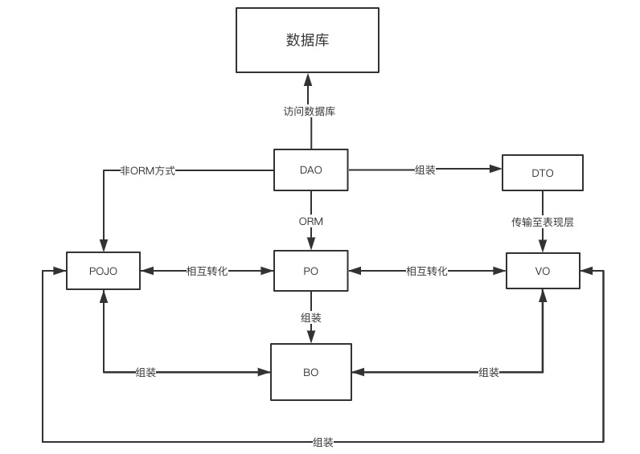

总结整理在学习SpringBoot的过程中遇到的问题和解决方案（我又双叒要开始更新博客了）。
本专题有很多内容涉及工作中遇到的具体问题，所以选择一部分笔记放到博客上来。

<!-- more -->

# 前言
忙忙碌碌的暑假结束了，虽然可以算得上十分充实，不过在学习新知识提高自己这一方面却做的并不尽如人意，之前制定的学习计划大都被其它各种计划所取代，
从屈指可数的博客更新就能看出来。
随着步入职场，自我学习变得更加重要，之前这段时间的状态不能再继续下去。写了这么多中心思想就一条：“我又双叒要开始更新博客了”。

## SSM框架

Java中常用的有三大框架SSM（Spring，SpringMVC和Mybatis），其中Spring是一个轻量级的控制反转（IoC）和面向切面（AOP）的容器框架，
是为了解决企业应用开发的复杂性而创建的。而SpringMVC属于SpringFrameWork的后续产品，已经融合在Spring Web Flow里面。
SpringMVC分离了控制器、模型对象、分派器以及处理程序对象的角色，这种分离让它们更容易进行定制。
MyBatis本是apache的一个开源项目iBatis, 2010年这个项目由apache software foundation 迁移到了google code，并且改名为MyBatis 。
MyBatis是一个基于Java的持久层框架。iBATIS提供的持久层框架包括SQL Maps和Data Access Objects（DAO）MyBatis
消除了几乎所有的JDBC代码和参数的手工设置以及结果集的检索。
MyBatis 使用简单的 XML或注解用于配置和原始映射，将接口和 Java 的POJOs（Plain Old Java Objects，普通的 Java对象）映射成数据库中的记录。

## SpringBoot简介

而我们之后要学习的SpringBoot则可以快速构建容易配置的 Spring 应用程序，使用SpringBoot可以减少配置的工作量。SpringBoot网站对它的简洁介绍如下：

“ Spring Boot 使您能轻松地创建独立的、生产级的、基于 Spring 且能直接运行的应用程序。我们对 Spring 平台和第三方库有自己的看法，
所以您从一开始只会遇到极少的麻烦。”

刚开始学习SpringBoot时可以从HelloWorld开始，此处网上例程很多，不再赘述。

# 概念剖析
首先学习几个Java开发中会遇到的概念。

## 1.DAO[data access object]数据访问对象
一个面向对象的数据库接口，负责持久层的操作，为业务层提供接口，主要用来封装对数据库的访问，常见操作无外乎 CURD。我们也可以认为一个 DAO 对应一个 POJO 的对象，它位于业务逻辑与数据库资源中间，可以结合 PO 对数据库进行相关的操作。
此处注意对数据访问不仅仅指的是对数据库的访问。 假如A系统调用B系统的服务获取数据，这时候A系统对B系统访问数据对象的封装也可以称为DAO。一般放一些名字类似XXXMapper的接口。

## 2.DTO[data transfer object]数据传输对象
主要用于远程调用等需要大量传输对象的地方，比如我们有一个交易订单表，含有20个字段，那么其对应的PO就有20个属性，但我们的页面上只需要显示5个字段，因此没有必要把整个 PO 对象传递给客户端，这时我们只需把仅有 5 个属性的 DTO 把结果传递给客户端即可，而且如果用这个对象来对应界面的显示对象，那此时它的身份就转为VO。使用DTO的好处有两个，一是能避免传递过多的无用数据，提高数据的传输速度；二是能隐藏后端的表结构。常见的用法是：将请求的数据或属性组装成一个RequestDTO，再将响应的数据或属性组装成一个 ResponseDTO.

## 3.PO[persistant object]持久层对象

由一组属性和属性的get和set方法组成，最简单的 PO 就是对应数据库中某个表中的一条记录（也就是说，我们可以将数据库表中的一条记录理解为一个持久层对象），多个记录可以用 PO 的集合，PO 中应该不包含任何对数据库的操作。PO 的属性是跟数据库表的字段一一对应的，此外 PO 对象需要实现序列化接口。因对象-关系映射（Object-Relational Mapping，简称ORM）框架的广泛使用而被引入到JavaEE项目设计中。

## 4.BO[bussiness object]业务对象

简单的真实世界的软件抽象，通常位于中间层。BO 的主要作用是把业务逻辑封装为一个对象，这个对象可以包括一个或多个其它的对象。举一个求职简历的例子，每份简历都包括教育经历、项目经历等，我们可以让教育经历和项目经历分别对应一个 PO，这样在我们建立对应求职简历的 BO 对象处理简历的时候，让每个 BO 都包含这些 PO 即可。

## 5.VO[value object]值对象

通常用于业务层之间的数据传递，和 PO 一样也是仅仅包含数据而已，但 VO 应该是抽象出的业务对象，可以和表对应，也可以不对应，这根据业务的需要。 如果锅碗瓢盆分别为对应的业务对象的话，那么整个碗柜就是一个值对象。此外，VO 也可以称为页面对象，如果称为页面对象的话，那么它所代表的将是整个页面展示层的对象，也可以由需要的业务对象进行组装而来。

## 6.POJO[plain ordiary java object] 简单java对象

实际就是普通的 JavaBeans，是为了避免和 EJB（Enterprise JavaBean）混淆所创造的简称。POJO 实质上可以理解为简单的实体类，其中有一些属性及其getter和setter方法的类，没有业务逻辑，也不允许有业务方法，也不能携带有connection之类的方法。POJO 是 JavaEE 世界里面最灵活的对象，在简单系统中，如果从数据库到页面展示都是 POJO 的话，它可以是 DTO；如果从数据库中到业务处理中都是 POJO 的话，它可以是 BO；如果从数据库到整个页面的展示的话，它也可以是 VO.

## 7.Entity 实体
对应数据库中的表，简单的理解为一个表对应一个实体，以交易订单表Order为例，若该表中含有20个字段，那么这个OrderEntity对象里面也要含有20个对应的属性。

# 参考资料
【1】详述 PO VO BO DTO DAO 和 POJO 的概念及区别https://blog.csdn.net/qq_35246620/article/details/77247427
