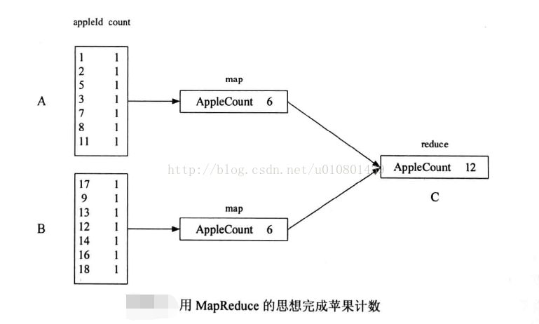

CMS系统学习，MapReduce思想学习,对Java8中对新特性stream，map和reduce进行学习

<!-- more -->
# 任务
先阅读cn.creditease.bdp.newcms.notice源码，定时相关，其中impl/CmsTaskNoticeHelperImpl/sendMsgByBatch函数是模块入口

阅读cn.creditease.bdp.newcms.cmswrapper.controller.PaymentScheduleController的源码，涉及到customer表，里面是借贷用户的信息

需求：CMS逾期天数计算方式优化

# 系统介绍

最早的site系统，scala语言，编译运行比较慢，一小时左右，包括了application，postloan等所有系统

测试官网网址：http://shangtongdai.yxapp.xyz/newsite/?code=YANGKAI34#/loginReg/login

查询语句：

    select * from shangtongdai.users
        where id in (
          select user_id from shangtongdai.applications
              where id in (
                    select application_id from shangtongdai.loans
                          where loan_status_id=12 ))

application系统：进件系统

巨星系统：数据中转

爬虫系统：爬取商户数据

miner系统：评级系统

postloan系统（贷后系统）

User系统：管理用户

User-refer系统：返还佣金

Report系统：做报表

Report-tool系统：基础查询

综合信贷系统：管理合同签约

新核心系统：管理还款计划表

结算系统：管理还款逻辑

添加店户会触发爬虫系统，爬取商户的数据，使用miner系统进行评级，巨星系统进行数据中转筛除。

评级通过之后，进件将由CMS系统进行审核，审核通过后，所有审核逻辑都在CMS系统中。

审核通过后，由postloan系统（贷后系统）处理，包括了：

1.合同管理：签约，管理状态,综合信贷系统管理合同签约

2.还款：还款计划表,新核心系统管理还款计划表

3.放款：结算系统管理还款逻辑

团队主要负责CMS，postloan和report，report-tool等系统。

application进件系统，爬虫系统，巨星系统，miner评级系统由进件团队负责。

CMS系统里有初审，复审，分发等36个状态。

***shangtongdai数据库表信息：***

transport表：进件表，维护进件状态，

transportlabel拒绝或接受打下标签

transportext 进件附加信息，以json格式存储（最重要）

transport_decisions:重大决策信息放款或其它

transport_assigned_history：客服分单给客户历史的信息

loan :合同

repayment：业务订单，用户还款会生成业务订单

loanrepayment：合同和业务订单的关系，一笔合同会有多笔订单

repayment_type字段，还款类型

repayment_order字段：

repaymenttags:业务订单信息

权限信息的相关表
privilege
role
role_privilege
user_role

任务相关的表
tb_cron_ini
cms_task

# MapReduce思想及Java中的实现

MapReduce源于Google一篇论文，它充分借鉴了分而治之的思想，将一个数据处理过程拆分为主要的Map(映射)与Reduce(化简)两步。用户不懂分布式计算框架的内部运行机制，只要能用Map和Reduce的思想描述清楚要处理的问题，即编写map()和reduce( )函数，就能轻松地使问题的计算实现分布式，并在Hadoop上运行。MapReduce的编程具有以下特点。

## 开发简单:
得益于MapReduce的编程模型，用户可以不用考虑进程间通信、套接字编程，无需非常高深的技巧，只需要实现一些非常简单的逻辑，其他的交由MapReduce计算框架去完成，大大简化了分布式程序的编写难度。
## 可扩展性强:
同HDFS一样，当集群资源不能满足计算需求时，可以通过增加节点的方式达到线性扩展集群的目的。
## 容错性强:
对于节点故障导致的作业失败，MapReduce计算框架会自动将作业安排到健康节点重新执行，直到任务完成，而这些，对于用户来说都是透明的。

## MapReduce的编程思想

Map(映射)与Reduce(化简)来源于LISP和其他函数式编程语言中的古老的映射和化简操作，MapReduce操作数据的最小单位是一个键值对。用户在使用MapReduce编程模型的时候，第一步就需要将数据抽象为键值对的形式，接着***map函数*** 会以键值对作为输入，经过map函数的处理，产生一系类新的键值对作为中间结果输出到本地。MapReduce计算框架会自动将这些中间结果数据按照键做聚合处理，并将键相同的数据分发给reduce函数处理(用户可以设置分发规则)。***reduce函数*** 以键和对应的值的集合作为输入，经过reduce函数的处理后，产生了另外一系列键值对作为最终输出。

如果用表达式表示，其过程如下式所示 :

    {Keyl，Value1}~{Key2, List<Value2>}~{Key3, Value3}
读者可能觉得上面的描述和表达式非常抽象，那么让我们先来看一个例子。有一篮苹果，一些是红苹果，一些是青苹果，每个苹果有一个唯一编号，要解决的问题是统计该篮苹果的数目、红苹果(深色)的个数和青苹果(浅色)的个数。

  假设有A, B, C三个人，A获得第一排苹果，B获得第二排苹果，这时，A和B分别统计自己手上的苹果的个数，然后将结果告知C, C将A, B的结果做一次汇总，得到最后结果。对于这个过程，其实用到了MapReduce的思想。我们可以从下一幅图看出端倪。

A的map函数的输入的格式为键值对appleId-count，比女fl " 11-1”表示appleId为11的苹果个数为1，经过map函数的累和，即将所有appleId的count相加，输出为新的键值对AppleCount-6，此时B也进行同样的操作，由于A和B的map函数输出的键值对的键相同，都为“AppleCount"，所以MapReduce框架会将其都分发到C作为reduce函数的输入，并在reduce函数中完成对键相同的值的累和，并输出最后结果AppleCount-12。如果用表达式表示，即为:

    (appleId, count}一>(AppleCount，List<count>}一>{AppleCount，count}

在这个例子中，就是用MapReduce的思想来完成苹果计数的问题，细心的读者可能发现，这个例子中reduce函数只执行了一次，是否可以执行多次呢，答案是肯定的，下面来看用MapReduce思想解决对红苹果和青苹果分别计数的问题。

假设有A, B. C, D四个人，A获得第一排苹果，B获得第二排苹果，A将手上的红苹果给C、青苹果给D、B将手上的红苹果给C、青苹果给D。C, D再统计各自手上的结果，得到最后结果，如下图所示。

A的map函数的输入同上次一样，在map函数中，用color和appleId作为新的键值对重新输出，B也做同样的操作。而A, B的map函数的输出的键值对会因为不同的键被分别分发到C和D执行:reduce函数，而真正的计数是由reduce函数完成，并输出最后结果。这里:reduce函数一共执行了两次，第一次是处理键为Red的数据.第二次是处理键为Green的数据。如果用表达式表示，即为:

    {appleId, count}~{color, List<appleId>}~{color, count}

要理解MapReduce的编程思想，其核心的一点就是将数据用键值对表示。在现实生活中，很多数据要么本身就为键值对的形式，要么可以用键值对这种方式来表示，例如电话号码和通话记录，文件名和文件存储的数据等，键值对并不是高端数据挖掘独有的数据模型，而是存在于我们身边非常普通的模型。

利用分而治之的思想，可以将很多复杂的数据分析问题转变为一系列MapReduce作业，利用Hadoop的提供MapReduce计算框架，实现分布式计算，这样就能对海量数据进行复杂的数据分析，这也是MapReduce的意义所在。

# Java8中的map和reduce

# 参考资料
【1】
https://blog.csdn.net/weixin_34112900/article/details/93630203
