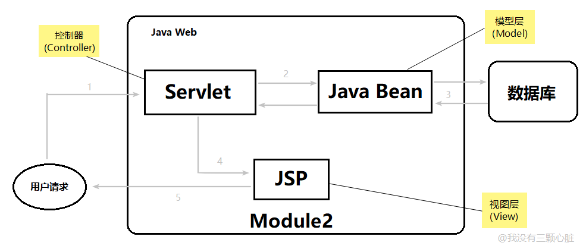
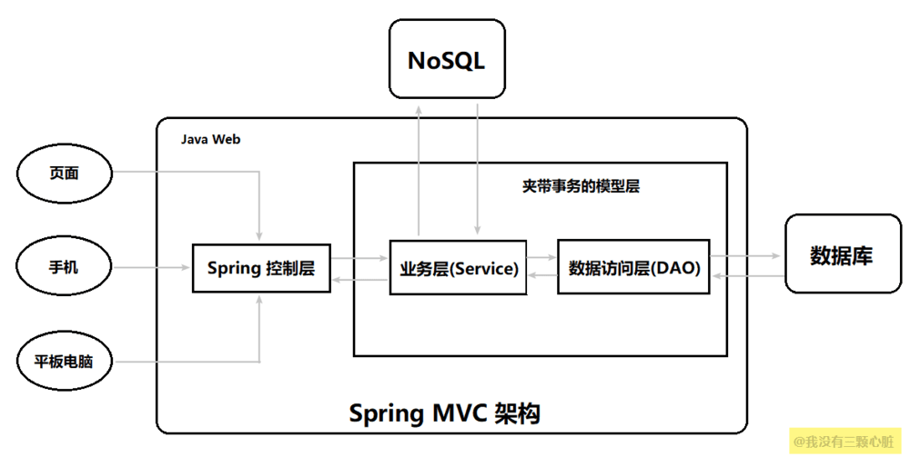

介绍了SpringMVC的基本概念和HTTP中Get与POST的区别。

<!-- more -->

# 原理详解

## SpringMVC是什么
早期 Java Web 的开发中，统一把显示层、控制层、数据层的操作全部交给 JSP 或者 JavaBean 来进行处理，我们称之为 Model1：

出现的弊端：

1.JSP 和 Java Bean 之间严重耦合，Java 代码和 HTML 代码也耦合在了一起

2.要求开发者不仅要掌握 Java ，还要有高超的前端水平

3.前端和后端相互依赖，前端需要等待后端完成，后端也依赖前端完成，才能进行有效的测试

4.代码难以复用

正因为上面的种种弊端，所以很快这种方式就被 Servlet + JSP + Java Bean 所替代了，早期的 MVC 模型（Model2）就像下图这样：

首先用户的请求会到达 Servlet，然后根据请求调用相应的 Java Bean，并把所有的显示结果交给 JSP 去完成，这样的模式我们就称为 MVC 模式。

M 代表 模型（Model）
模型是什么呢？ 模型就是数据，就是 dao,bean

V 代表 视图（View）
视图是什么呢？ 就是网页, JSP，用来展示模型中的数据

C 代表 控制器（controller)
控制器是什么？ 控制器的作用就是把不同的数据(Model)，显示在不同的视图(View)上，Servlet 扮演的就是这样的角色。
### Spring MVC 的架构

为解决持久层中一直未处理好的数据库事务的编程，又为了迎合 NoSQL 的强势崛起，Spring MVC 给出了方案

传统的模型层被拆分为了业务层(Service)和数据访问层（DAO,Data Access Object）。 在 Service 下可以通过 Spring 的声明式事务操作数据访问层，而在业务层上还允许我们访问 NoSQL ，这样就能够满足异军突起的 NoSQL 的使用了，它可以大大提高互联网系统的性能。

特点：

1.结构松散，几乎可以在 Spring MVC 中使用各类视图

2.松耦合，各个模块分离

3.与 Spring 无缝集成

## HTTP中Get与POST的区别
Get和Post是两种Http请求方式：

***GET-从指定的资源请求数据***

***POST-向指定的资源提交要被处理的数据***

### GET方法
查询字符串（名称/值对）是在GET请求的URL中发送的：

    http://localhost:8080/Merchant/SelectByMerchantNo?name1=value1&name2=value2

GET 请求可被缓存

GET 请求保留在浏览器历史记录中

GET 请求可被收藏为书签

GET 请求不应在处理敏感数据时使用

GET 请求有长度限制

GET 请求只应当用于取回数据

### POST方法

查询字符串（名称/值对）是在 POST 请求的 HTTP 消息主体中发送的：

    POST /test/demo_form.asp HTTP/1.1
    Host: w3schools.com
    name1=value1&name2=value2

POST 请求不会被缓存

POST 请求不会保留在浏览器历史记录中

POST 不能被收藏为书签

POST 请求对数据长度没有要求

|                  | Get                               | POST                                                                                 |
| ---------------- | --------------------------------- | ------------------------------------------------------------------------------------ |
| 后退按钮/刷新    | 无害                              | 数据会被重新提交（浏览器应该告知用户数据会被重新提交                                 |
| 书签             | 可收藏为书签                      | 不可收藏为书签                                                                       |
| 缓存             | 能被缓存                          | 不能缓存                                                                             |
| 编码类型         | application/x-www-form-urlencoded | application/x-www-form-urlencoded 或 multipart/form-data。为二进制数据使用多重编码。 |
| 历史             | 参数保留在浏览器历史中            | 参数不会保留在浏览器历史中                                                           |
| 对数据长度的限制 | 只允许ASCII字符                   | 没有限制，也允许二进制数据                                                           |
| 安全性           | 较差，因为发送的数据是URL的一部分 | POST比GET更安全，因为参数不会被保留在浏览器历史或WEB服务器日志中                     |
| 可见性           | 数据在URL中对所有人都是可见的     | 数据不会显示在URL在中                                                                                     |

其它HTTP请求方法

| 方法    | 描述                                        |
| ------- | ------------------------------------------- |
| HEAD    | 与GET相同，但只返回HTTP报头，不返回文档主体 |
| PUT     | 上传指定但URI表示                           |
| DELETE  | 删除指定资源                                |
| OPTIONS | 返回服务器支持但HTTP方法                    |
| CONNECT | 把请求连接转换到透明的TCP/IP通道                                            |

# 参考资料：
【1】https://www.jianshu.com/p/91a2d0a1e45a
