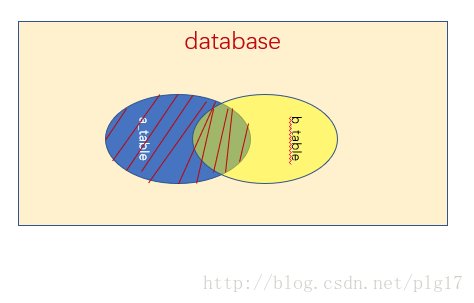
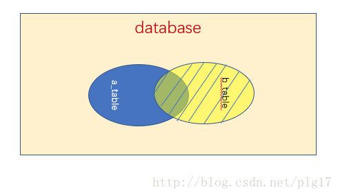

SQL分页查询

<!-- more -->

# SQL分页查询
使用SELECT查询时，如果结果集数据量很大，比如几万行数据，放在一个页面显示的话数据量太大，不如分页显示，每次显示100条。

要实现分页功能，实际上就是从结果集中显示第1 ~ 100条记录作为第1页，显示第101~200条记录作为第2页，以此类推。

因此，分页实际上就是从结果集中“截取”出第M~N条记录。这个查询可以通过LIMIT <M> OFFSET <N>子句实现。

例如基本查询语句：

    SELECT id,name,gender,score
    FROM students
    ORDER BY score DESC;

现在将结果集分页，每页3条记录。要获取第一页的记录，可以使用 LIMIT 3 OFFSET 0:

    SELECT id,name,gender,score
    FROM students
    ORDER BY score DESC
    LIMIT 3 OFFSET 0;

上述查询LIMIT 3 OFFSET 0表示：
对结果集从0号记录开始，最多取3条（注意SQL记录集对索引从0开始）。
若要查询第2页，那么我们只需要跳过前3条记录，即对结果集从3号记录开始查询，把OFFSET设定为3:

    SELECT id,name,gender,score
    FROM students
    ORDER BY score DESC
    LIMIT 3 OFFSET 3;

类似的，查询第3页的时候，OFFSET应该设为6，查询第4页的时候，OFFSET应该设为9.如果查询的表第4页只有1条记录，则最终结果按照实际数量1显示，LIMIT 3表示的意思是“最多3条记录”。

可见分页查询的关键在于，首先要确定每页需要显示的结果数量pageSize，然后根据当前页的索引pageIndex（从1开始），确定LIMIT和OFFSET应该设定的值：

LIMIT总是设定为pageSize；
OFFSET计算公式为pageSize*（pageIndex-1）。

## 扩展思考
如果原本记录集只有10条记录，但我们将OFFSET设置为20，结果会怎样呢？
答案是OFFSET超过查询的最大数量并不会报错，而是会得到一个空的结果集

## 注意
OFFSET是可选的，OFFSET缺省值为0.即LIMIT 3 相当于LIMIT 3 OFFSET 0
在MySQL中，LIMIT 3 OFFSET 0也可简写为LIMIT 3，0
使用LIMIT M OFFSET N进行分页查询时，N越大查询效率越低。

# SQL连接查询
连接查询是将两个或两个以上的表按某些条件连接起来，从中选取需要的数据。可以分为内连接查询(通过where实现)和外连接查询（join）。

## 内连接查询
只有不同表中有相同意义的字段时才能进行连接，而且内连接查询只查询出指定字段取值相同的记录。

    一般语法:
    select a.* , b.*
    from table_a as a, table_b as b
    where a.id = b.id;
## 外连接查询
需要通过指定字段来进行连接。当该字段取值相等时，可以查询出该记录；而且当该字段不等时，也可以查询出来。包括左连接，右连接查询。

    一般语法：
    select 属性名列表
    from 表1
    left | right join 表2
    on 表1.属性名 = 表2.属性名;

### 左外连接
left join 是left outer join的简写，它的全称是左外连接，是外连接中的一种。
左(外)连接，左表(a_table)的记录将会全部表示出来，而右表(b_table)只会显示符合搜索条件的记录。右表记录不足的地方均为NULL。

### 右外连接
右外连接与左外连接相对称，
right join是right outer join的简写，它的全称是右外连接，是外连接中的一种。
与左(外)连接相反，右(外)连接，左表(a_table)只会显示符合搜索条件的记录，而右表(b_table)的记录将会全部表示出来。左表记录不足的地方均为NULL。

### 外连接查询加条件语句

使用外连接查询时，可以加上各种条件进行筛选。

    select table1.column1, table2.column1
    from table1
    join table2
    on table1.column2 = table2.column3;

    select table1.column1, table2.column1
    from table1,table2
    where table1.column2 = table2.column3;

## 子查询
子查询时将一个查询语句嵌套在另一个查询语句中，内层查询语句的查询结果，可以为外层查询语句提供查询条件。在特定情况下：一个查询语句的条件需要另一个查询语句来获取。
子查询，又叫内部查询，相对于内部查询，包含内部查询的就称为外部查询。

子查询可以包含普通select可以包括的任何子句，比如：distinct、 group by、order by、limit、join和union等；但是对应的外部查询必须是以下语句之一：select、insert、update、delete、set或 者do。

注：一个查询语句只能有一个order by ，在子查询中只能位于外部查询后面.

### 分类

子查询分为如下几类：
1）. 标量子查询：返回单一值的标量，最简单的形式。
2）. 列子查询：返回的结果集是 N 行一列。
3）. 行子查询：返回的结果集是一行 N 列。
4）. 表子查询：返回的结果集是 N 行 N 列。
可以使用的操作符：= > < >= <= <> ANY IN SOME ALL EXISTS

释义：一个子查询会返回一个标量（就一个值）、一个行、一个列或一个表，这些子查询称之为标量、行、列和表子查询。

### 带有any关键字的子查询

any关键字表示满足其中任一条件，使用any关键字时，只要满足内层查询语句返回的结果中的任何一个，就可以通过该条件来执行外层查询语句。

从computer表中查询哪些人分数高于任何一个奖学金的最低分。

    select * from computer_stu
    where score >= ANY
                      (select score From  scholarship);
### 带有all关键字的子查询

表示需要满足所有的条件。只有满足内层查询语句返回的所有结果，才可以执行外层查询语句。

### 带有exists关键字的子查询

exists关键字表示存在，内层查询语句不返回查询的记录，而是返回一个真假值，如果内层查询语句查询到满足条件的记录，就返回一个true，外层查询语句将进行查询。

    select * from employee
    where exists (select d_name from department where d_id = 1003);
    //如果department存在d_id为1003，则查询employee表。
还可以分为相关子查询，独立子查询。以上子查询与外层查询没有关联，称为独立子查询，如果子查询有用到外层查询的字段，则称相关子查询，相关子查询容易产生性能问题。

# 参考资料：

【1】https://www.liaoxuefeng.com/wiki/1177760294764384/1217864791925600
【2】https://blog.csdn.net/plg17/article/details/78758593
【3】https://cloud.tencent.com/developer/article/1333120
